# **rapport_tp1.md — TP1 Docker & Systèmes de Machine Learning**
NIAURONIS Tatiana – FIPA 3A  
CSC8613 – TP1 : Docker & Environnements ML  

---

## **Exercice 1 — Installation de Docker**

### **Question 1.a**
Docker est installé correctement et fonctionne sur la machine.

### **Question 1.b**
Après la commande :

```
docker run hello-world
```

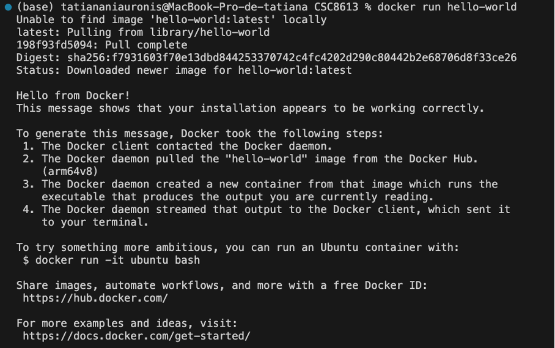

Docker a bien téléchargé l’image hello-world et lance un conteneur basé sur cette image qui affiche un message.

### **Question 1.c**


La commande docker ps -a liste tous les conteneurs présents sur la machine, qu’ils soient en cours d’exécution ou arrêtés. On y voit par exemple le conteneur hello-world avec un statut Exited, car il a fini d’exécuter sa tâche qui était celle d’afficher le message et s’est arrêté. On a aussi un autre conteneur utilisé il y’a 10 mois.

---

## **Exercice 2 — Premiers pas : images & conteneurs**

### **Question 2.a**
Une image est un modèle immuable d’un environnement qui se construit à partir d’un Dockerfile et contient du code, des dépendances, une configuration, un système de fichier…  

Un conteneur est une instance en cours d’exécution d’une image et possède son propre système de fichier, ses propres processus, et son propre réseau.

### **Question 2.b**

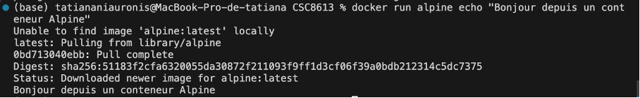

Docker télécharge l’image Alpine puis crée un conteneur temporaire pour exécuter la commande echo demandée. On voit que le conteneur affiche bien le message “Bonjour depuis un conteneur Alpine”, puis s’arrête, car il n’a plus aucune tâche à exécuter.

### **Question 2.c**

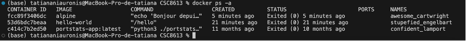

Le conteneur Alpine apparaît avec le statut Exited, car il a terminé sa tâche (exécuter un echo). Dès qu’un conteneur n’a plus de processus actif, Docker l’arrête. Il reste visible dans docker ps -a tant qu’il n’est pas supprimé.

### **Question 2.d**


La commande ls montre la structure du système Linux. Alpine embarque uniquement les répertoires essentiels (bin, etc, lib, tmp…) ce qui confirme qu’il s’agit d’une distribution très légère.

La commande uname -a affiche les informations du noyau Linux utilisé dans le conteneur. On a un un noyau LinuxKit, isolé du système hôte.

La commande exit quitte le shell.

---

## **Exercice 3 — Construction d’une image FastAPI**

### **Étape 1 — Compléter le fichier app.py**

### **Question 3.a**
```yaml
# app.py

# TODO: importer FastAPI
from fastapi import FastAPI

# TODO: créer une instance FastAPI
app = FastAPI()

# TODO: définir une route GET /health
@app.get("/health")
def health():
    return {"status": "ok"}
```

### **Étape 2 — Compléter le Dockerfile**

### **Question 3.b**
```dockerfile

# TODO: choisir une image de base Python
FROM python:3.11-slim

# TODO: définir le répertoire de travail dans le conteneur
WORKDIR /app

# TODO: copier le fichier app.py
COPY app.py /app/app.py

# Installer FastAPI et Uvicorn
RUN pip install fastapi uvicorn

# TODO: lancer le serveur au démarrage du conteneur
CMD ["uvicorn", "app:app", "--host", "0.0.0.0", "--port", "8000"]
```

### **Étape 3 — Construire l'image Docker**

### **Question 3.c**


---

## **Exercice 4 — Exécuter l’API FastAPI**

### **Étape 1 — Lancer le conteneur**

### **Question 4.a**


L’option -p 8000:8000 expose le port 8000 du conteneur sur le port 8000 de la machine hôte.

### **Question 4.b**

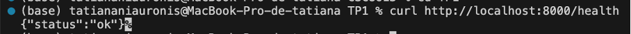
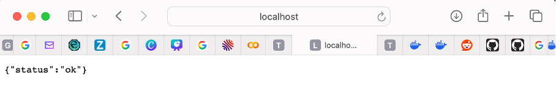

### **Étape 3 — Observer les conteneurs en cours d'exécution**

### **Question 4.c**


À partir de cette sortie, on peut identifier :

- Nom du conteneur : silly_moore  
- Image utilisée : simple-api  
- Port mappé : 0.0.0.0:8000->8000/tcp pour IPv4 et :::8000->8000/tcp pour IPv6

### **Étape 4 — Arrêter le conteneur**

### **Question 4.d**


La commande docker ps n’affiche plus le conteneur, car il n’est plus en cours d’exécution mais docker ps -a l’affiche toujours, avec statut Exited car Docker conserve les conteneurs arrêtés tant qu’ils ne sont pas supprimés.

---

## **Exercice 5 — Démarrer un mini-système multi-conteneurs avec Docker Compose**

### **Étape 1 — Préparer la structure des fichiers**

### **Question 5.a**

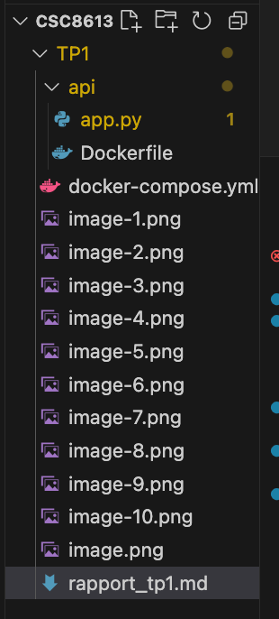

### **Étape 2 — Compléter le fichier docker-compose.yml**

### **Question 5.b**

```yaml
version: "3.9"

services:
  db:
    image: postgres:16
    environment:
      # TODO: définir l'utilisateur, le mot de passe et le nom de la base
      POSTGRES_USER: demo
      POSTGRES_PASSWORD: demo
      POSTGRES_DB: demo
    ports:
      # TODO: exposer le port PostgreSQL vers l'hôte
      - "5432:5432"

  api:
    # TODO: construire l'image à partir du Dockerfile dans ./api
    build: ./api
    ports:
      # TODO: exposer le port 8000 du conteneur vers l'hôte
      - "8000:8000"
    depends_on:
      # TODO: indiquer que l'API dépend de la base de données
      - db
```

### **Étape 3 — Démarrer la stack avec Docker Compose**

### **Question 5.c**

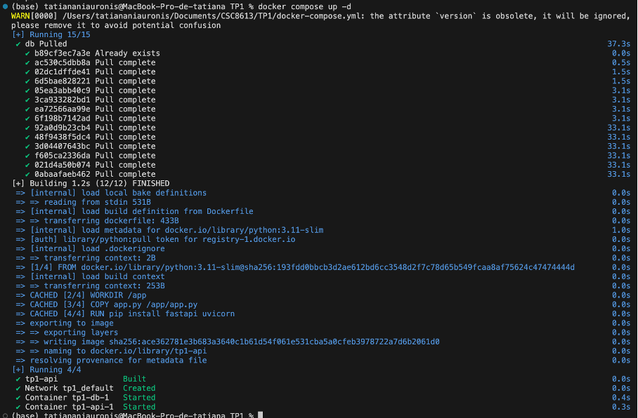


Les services db et api sont bien démarrés.

### **Étape 4 — Tester à nouveau l’endpoint /health**

### **Question 5.d**

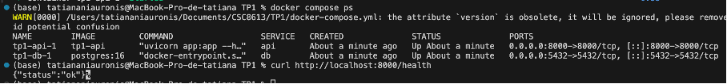


### **Étape 5 — Arrêter proprement les services**

### **Question 5.e**


docker compose down arrête tous les services définis, supprime les conteneurs et le réseau Docker Compose alors que docker stop <id> arrête seulement un conteneur individuel sans le supprimer et s'attend à avoir l'id du conteneur derrière.

---

## **Exercice 6 — Interagir avec la base de données PostgreSQL dans un conteneur**

### **Pré-requis**

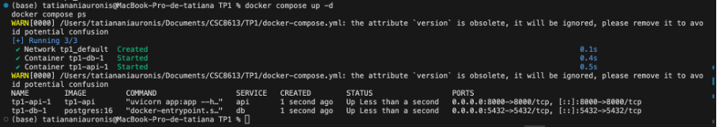

La stack est bien démarrée.

### **Étape 1 — Se connecter au conteneur PostgreSQL**

### **Question 6.a**
exec permet d'exécuter une commande dans un conteneur en cours d’exécution, db correspond au nom du service ciblé. -U demo correspond à l'utilisateur PosgreSQL et -d demo à la base de données à sélectionner.

### **Étape 2 — Exécuter quelques commandes SQL simples**

### **Question 6.b**

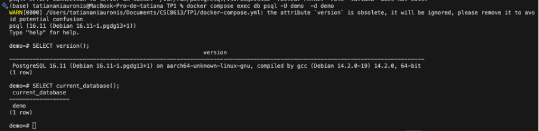

SELECT version(); indique que la base de données utilise PostgreSQL 16.11 (Debian, 64-bit) sur une architecture aarch64 (environnement Linux dans le conteneur) et SELECT current_database(); confirme que la base actuellement utilisée est bien nommée demo, comme défini dans le docker-compose.yml.

### **Étape 3 — Comprendre la connexion depuis d'autres services**

### **Question 6.c**
Dans Docker Compose, les services partagent un réseau interne, ce qui permet à un autre service de se connecter à la base PostgreSQL en utilisant simplement le nom du service comme hostname. Ainsi, pour accéder à la base, le service doit utiliser `db` comme hostname. La connexion se fait sur le port standard PostgreSQL, `5432`. Les identifiants de connexion à utiliser sont ceux définis dans les variables d’environnement du service PostgreSQL, à savoir l’utilisateur `demo`, le mot de passe `demo`, et la base de données `demo`.

### **Étape 4 — Nettoyer**

### **Question 6.d**

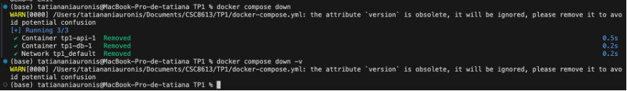

Après les tests, la commande `docker compose down` permet d’arrêter la stack et de supprimer les conteneurs ainsi que le réseau associé, mais elle laisse les volumes Docker intacts. En revanche, l’option `-v` demande en plus la suppression des volumes liés aux services, donc des données persistantes stockées par PostgreSQL. Donc toutes les tables et le contenu de la base `demo` sont effacés.

---

## **Exercice 7 — Déboguer Docker**

### **Étape 1 — Afficher les logs d’un service**

### **Question 7.a**


Au démarrage de l’API, les logs affichent que le serveur est lancé: Uvicorn running on http://0.0.0.0:8000.
Lorsque j’envoie une requête GET /health (via curl http://localhost:8000/health), une ligne apparaît dans les logs avec un statut 200 OK, ce qui confirme que l’endpoint /health répond correctement.

### **Étape 2 — Entrer dans un conteneur en cours d’exécution**

### **Question 7.b**

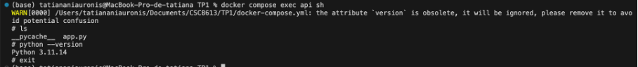

On voit bien app.py dans les fichiers listés avec ls. La version de python est bien en 3.11.

### **Étape 3 — Redémarrer un service**

### **Question 7.c**


La commande /health renvoie toujours {"status": "ok"} donc l’API est donc bien redemarrée. Un redémarrage de service est utile lorsque l’API ne répond plus, après une modification de configuration, ou pour relancer proprement un service sans arrêter toute la stack.

### **Étape 4 — Conteneur qui ne démarre pas : diagnostic**

### **Question 7.d**

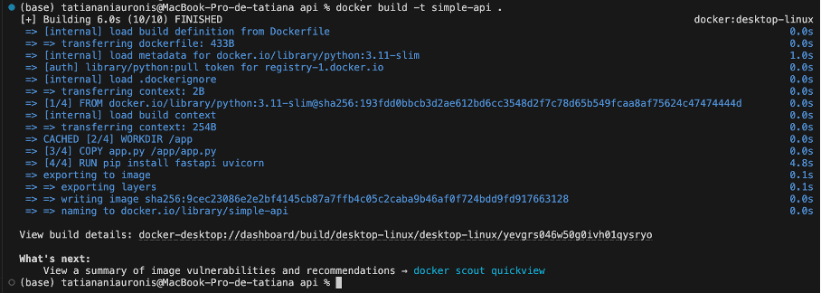


On voit que l’erreur provient directement du fichier app.py : @app.get("/health") fait référence à une variable app qui n’existe plus, car elle a été renommée en appi. C’est en lisant cette partie des logs (la fin) que j’ai pu identifier la cause exacte du problème.


### ** Étape 5 — Supprimer des conteneurs et images** 

### **Question 7.e**

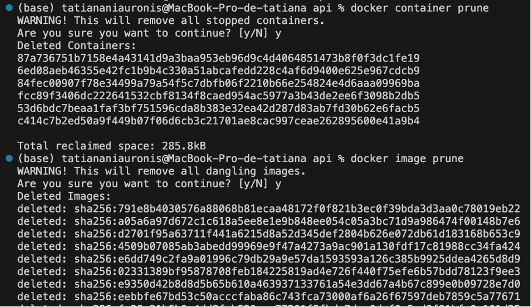

Il est utile de nettoyer régulièrement son environnement Docker pour éviter d’occuper de l’espace disque inutilement, éviter les conflits entre anciennes images et nouvelles versions et garder un environnement propre, lisible et plus facile à déboguer.

---

## **Exercice 8 — Questions de réflexion**

### **Questions de réflexion**

### **Question 8.a**
Un notebook Jupyter est un bon outil pour expérimenter, mais il n’est pas adapté au déploiement réel d’un modèle de Machine Learning. Cela s’explique par plusieurs limites:

- Premièrement un manque de reproductibilité. En effet, un notebook ne garantit pas que deux exécutions donneront le même résultat car l’ordre des cellules peut varier.
- Un environnement d'éxécution flou car les notebooks utilisent l’environnement local du développeur (librairies, versions…) et cela entraîne rapidement des conflits de dépendances alors que Docker fourni un environnement controlé.
- Un notebook n’intègre pas le versionnage du code, des données ou des modèles mais Docker si.
- Un notebook ne permet pas de monitorer les performances du modèle en production (erreurs, latence…) alors qu'en production les données évoluent et il faut les monitorer.
- Pas de scalabilité ni d'API.

### **Question 8.b**
Dans un système de Machine Learning, plusieurs composants doivent fonctionner ensemble : API d’inférence, base de données etc.  Docker Compose est donc un outil essentiel car:
  
Il permet de définir toute l’architecture dans un seul fichier (`docker-compose.yml`).  Ainsi, n’importe qui peut reproduire exactement le même environnement sur sa machine. Cela assure donc la reproductibilité. Il gère les dépendances (API et base de données).
  
De plus, une seule commande permet de lancer toute la stack :  
```bash
docker compose up -d
```

