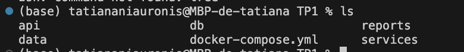
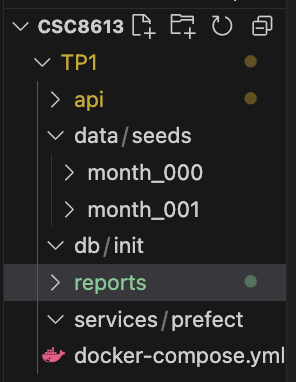
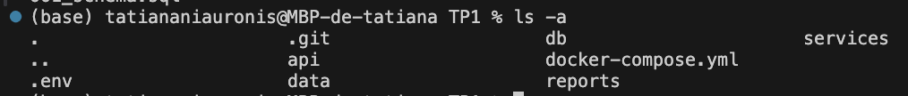
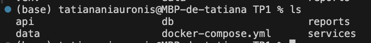
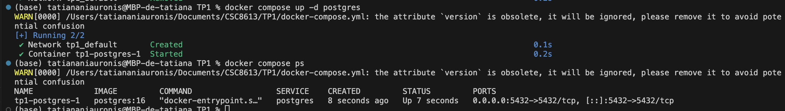
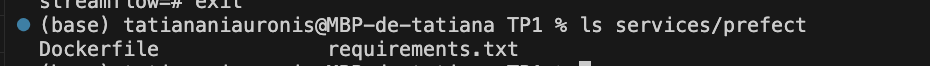
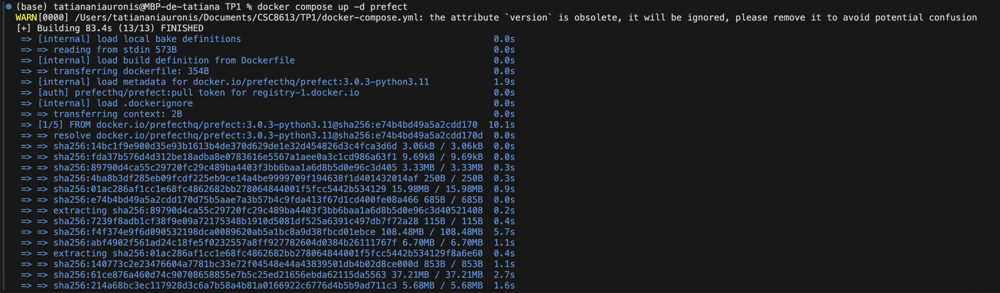
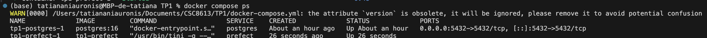
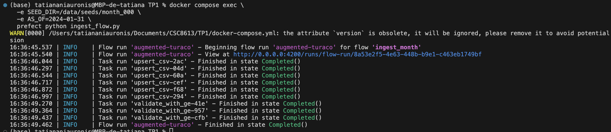

# **rapport_tp2.md — TP2 Ingestion mensuelle, validation et snapshots**
NIAURONIS Tatiana – FIPA 3A  
CSC8613 – TP2

---

## **Exercice 1 — Mise en place du projet et du rapport**

### **Question 1.a**

*État initial du dépôt*

```
(base) tatiananiauronis@MBP-de-tatiana TP1 % ls
api                     docker-compose.yml      reports
(base) tatiananiauronis@MBP-de-tatiana TP1 % git status
On branch main
Your branch is up to date with 'origin/main'.

Untracked files:
  (use "git add <file>..." to include in what will be committed)
        reports/rapport_tp2.md

nothing added to commit but untracked files present (use "git add" to track)
```

On voit bien que la structure correspond aux attendus avec api/, reports/ et le docker-compose.yml. 
La commande git status montre que je n'ai pas encore poussé le rapport du TP 2 ce qui est normal.

### **Question 1.b**





On a bien la structure demandée.

### **Question 1.c**

*Structure des données*

```
(base) tatiananiauronis@MBP-de-tatiana TP1 % ls data/seeds/month_000
labels.csv              subscriptions.csv       usage_agg_30d.csv
payments_agg_90d.csv    support_agg_90d.csv     users.csv
(base) tatiananiauronis@MBP-de-tatiana TP1 % ls data/seeds/month_001
labels.csv              subscriptions.csv       usage_agg_30d.csv
payments_agg_90d.csv    support_agg_90d.csv     users.csv
```

---

## **Exercice 2 — Base de données et docker-compose**

### **Question 2.a**

```
(base) tatiananiauronis@MBP-de-tatiana TP1 % ls db/init 
001_schema.sql
```

Le schéma a bien été crée.

### **Question 2.b**



Le fichier .env sert à centraliser les variables sensibles ou configurables (identifiants, mots de passe, noms de base) comme ici.
Il permet de séparer la configuration du code et d’injecter automatiquement ces valeurs dans les conteneurs Docker sans jamais hardcoder ces informations dans le code Python ou dans docker-compose.yml.

### **Question 2.c**



Le fichier docker-compose.yml est bien à la racine du projet. Voici son contenu:

```dockerfile

version: "3.9"

services:

  # api:
  #   # TODO: construire l'image à partir du Dockerfile dans ./api
  #   build: ./api
  #   ports:
  #     # TODO: exposer le port 8000 du conteneur vers l'hôte
  #     - "8000:8000"
  #   depends_on:
  #     # TODO: indiquer que l'API dépend de la base de données
  #     - db

  postgres:
    image: postgres:16
    env_file: .env         
    volumes:
      - ./db/init:/docker-entrypoint-initdb.d  
      - pgdata:/var/lib/postgresql/data
    ports:
      - "5432:5432"       

  prefect:
    build: ./services/prefect
    depends_on:
      - postgres
    env_file: .env      # Réutiliser les mêmes identifiants Postgres
    environment:
      PREFECT_API_URL: http://0.0.0.0:4200/api
      PREFECT_UI_URL: http://0.0.0.0:4200
      PREFECT_LOGGING_LEVEL: INFO
      POSTGRES_HOST: postgres
      POSTGRES_PORT: 5432
      POSTGRES_USER: ${POSTGRES_USER}
      POSTGRES_PASSWORD: ${POSTGRES_PASSWORD}
      POSTGRES_DB: ${POSTGRES_DB}
    volumes:
      - ./services/prefect:/opt/prefect/flows
      - ./data:/data:ro      # Rendre les CSV accessibles au conteneur Prefect

volumes:
  pgdata:

```

### **Question 2.d**

On démarre premièrement le contenur et on liste les conteneurs avec docker ps:



On se connecte à la base de données depuis le conteneur et on liste les tables existantes:

```
streamflow=# \dt
               List of relations
 Schema |       Name       | Type  |   Owner    
--------+------------------+-------+------------
 public | labels           | table | streamflow
 public | payments_agg_90d | table | streamflow
 public | subscriptions    | table | streamflow
 public | support_agg_90d  | table | streamflow
 public | usage_agg_30d    | table | streamflow
 public | users            | table | streamflow
(6 rows)
```

users contient les informations de base sur les utilisateurs avec son identifiant unique client, sa date d'inscription, son genre, s'il est considéré comme senior ou s'il a une famille. (ou personnes à charge)

subscriptions décrit l’abonnement de chaque utilisateur (nombre de mois actifs, type d'abonnement, facturation sans papier, prix mensuel, montant total payé, service principal utilisé, et les différents add-ons)

usage_agg_30d regroupe des statistiques d'utilisation du service sur les 30 derniers jours avec heures de visionnage, durée moyenne des sessions, nombre d’appareils utilisés...

payments_agg_90d contient le nombre d'échecs de paiements sur les 90 derniers jours.

support_agg_90d regroupe l’activité du support client sur les 90 derniers jours, incluant nombre de tickets ouverts et durée moyenne de résolution.

labels contient la variable cible churn_label (0 ou 1), indiquant si l’utilisateur a résilié ou non.

---

## **Exercice 3 — Upsert des CSV avec Prefect (month_000)**

### **Question 3.a**



On a bien la bonne structure.

Le conteneur prefect joue le rôle d’orchestrateur du pipeline d’ingestion, il exécute les flows (pipelines) Prefect qui lisent les CSV, les chargent dans PostgreSQL, appliquent la validation (Great Expectations) et, plus tard, créeront les snapshots. C’est lui qui coordonne les différentes étapes du système de machine learning (ingestion, validation, snapshots) de façon reproductible et automatisée.

### **Question 3.b**

La fonction upsert_csv orchestre l’ingestion des fichiers CSV vers PostgreSQL en garantissant l’absence de doublons grâce à l'upsert.

 Elle lit d’abord le fichier dans un DataFrame pandas, convertit les types nécessaires (dates, booléens), puis crée une table temporaire dans laquelle toutes les données du CSV sont insérées. Ensuite, elle copie ces données vers la table finale avec un INSERT ... ON CONFLICT DO UPDATE, ce qui met automatiquement à jour les lignes déjà existantes tout en ajoutant les nouvelles. Une fois l’opération terminée, la table temporaire est supprimée. On a donc une ingestion propre, efficace et idempotente.


### **Question 3.c**

On a bien lancé le service prefect:




```
(base) tatiananiauronis@MBP-de-tatiana TP1 % docker compose exec postgres psql -U streamflow -d streamflow
WARN[0000] /Users/tatiananiauronis/Documents/CSC8613/TP1/docker-compose.yml: the attribute `version` is obsolete, it will be ignored, please remove it to avoid potential confusion 
psql (16.11 (Debian 16.11-1.pgdg13+1))
Type "help" for help.

streamflow=# SELECT COUNT(*) FROM users;
 count 
-------
  7043
(1 row)

streamflow=# SELECT COUNT(*) FROM subscriptions;
 count 
-------
  7043
(1 row)
```

Après ingestion du mois 000, la base contient 7043 clients. Chaque utilisateur possède une entrée dans users et dans subscriptions: chaque client a un abonnement associé ce qui est cohérent.

---

## **Exercice 4 — Validation des données avec Great Expectations**

### **Question 4.a**

La fonction `validate_with_ge` ajoute une étape de contrôle qualité dans le pipeline d’ingestion. Pour une table donnée, elle lit les données depuis PostgreSQL, applique des règles Great Expectations (structure des colonnes, valeurs non nulles, bornes) puis valide ces règles.  
Si une expectation échoue, la fonction lève une exception et fait échouer le flow Prefect, ce qui empêche de continuer le pipeline avec des données corrompues ou incohérentes.  
Cette étape sert donc de garde-fou avant les prochaines étapes (snapshots, entraînement de modèle...).

### **Question 4.b**



On a relancé l'ingestion et la pipeline se finit sans erreur.

### **Question 4.c**

*Validation des données*

```python
gdf.expect_column_values_to_be_between("watch_hours_30d", min_value=0)
gdf.expect_column_values_to_be_between("avg_session_mins_7d", min_value=0)
gdf.expect_column_values_to_be_between("unique_devices_30d", min_value=0)
gdf.expect_column_values_to_be_between("skips_7d", min_value=0)
```

Les variables de la table usage_agg_30d représentent des mesures d’activité utilisateur calculées sur les 30 derniers jours : temps regardé, durée moyenne de session, nombre d’appareils uniques...
Ces indicateurs ne peuvent jamais être négatifs dans un système réel : on ne peut pas regarder un nombre d’heures négatif, ni utiliser -10 appareils par exemples.

C’est pourquoi nous imposons une borne minimale à 0 pour toutes les colonnes numériques afin de garantir que les données respectent les contraintes physiques et métier du domaine.

Ces règles protègents mon futur modèle:

Elles empêchent l’ingestion de valeurs impossibles, souvent causées par un bug d’export ou une corruption de fichier et elles bloquent le pipeline avant qu’un modèle ne soit entraîné avec des données incohérentes, ce qui éviterait un apprentissage biaisé ou des prédictions inutilisables. Ainsi, elles détectent très tôt les anomalies, avant qu’elles ne contaminent les snapshots et toute la chaîne ML.

---

## **Exercice 5 — Snapshots et ingestion month_001**

### **Question 5.a**

La fonction snapshot_month(as_of) crée, si nécessaire, les tables de snapshots et y copie l’état complet des données pour une date donnée : le paramètre as_of représente la "photo temporelle" du mois considéré, ce qui permet de figer les données à un instant précis afin de garantir la reproductibilité des entraînements futurs du modèle.

### **Question 5.b**

On obtient:

```
(base) tatiananiauronis@MBP-de-tatiana TP1 % docker compose exec postgres psql -U streamflow -d streamflow

WARN[0000] /Users/tatiananiauronis/Documents/CSC8613/TP1/docker-compose.yml: the attribute `version` is obsolete, it will be ignored, please remove it to avoid potential confusion 
psql (16.11 (Debian 16.11-1.pgdg13+1))
Type "help" for help.

streamflow=# SELECT COUNT(*) FROM subscriptions_profile_snapshots WHERE as_of = '2024-01-31';
SELECT COUNT(*) FROM subscriptions_profile_snapshots WHERE as_of = '2024-02-29';
 count 
-------
  7043
(1 row)

 count 
-------
  7043
(1 row)
```

Les deux dates (2024-01-31 et 2024-02-29) contiennent exactement 7043 lignes. Cela signifie que le nombre d’utilisateurs présents dans la base n’a pas changé entre les deux mois.

Les datasets month_000 et month_001 contiennent exactement les mêmes utilisateurs : seuls certains attributs changent (engagement, usage, facturation…), mais pas la liste des user_id et le snapshot capture l’état du profil d’un utilisateur à une date donnée, donc le pipeline crée une ligne par utilisateur et par mois.

### **Question 5.c**

                ┌──────────────────────────┐
                │    CSV sources month_00X │
                │  (users, subscriptions,  │
                │   labels, usage...)      │
                └────────────┬─────--──────┘
                             │
                             ▼
                     ┌────────────────┐
                     │   Upsert CSV   │
                     │ (new table +   │
                     │  INSERT...ON   │
                     │  CONFLICT DO   │
                     │     UPDATE )   │
                     └───────┬────────┘
                             │
                             ▼
                   ┌────────────────────┐
                   │ Validation GE      │
                   │ (tables: users,    │
                   │  subscriptions,    │
                   │  usage_agg_30d)    │
                   └─────────┬──────────┘
                             │
                             ▼
                 ┌─────────────────────────┐
                 │   snapshot_month(as_of) │
                 │  → *_snapshots tables   │
                 │  (profil figé du mois)  │
                 └───────────┬─────────────┘
                             │
                             ▼
                   ┌──────────────────┐
                   │   PostgreSQL     │
                   │ (live + snapshots│
                   │   versionnés)    │
                   └──────────────────┘


*Pourquoi on ne travaille pas directement sur les tables live pour entraîner un modèle ?*

On n’utilise pas les tables live pour entraîner un modèle, car elles changent en permanence et contiennent déjà les informations corrigées ou mises à jour d'après. Ainsi, le modèle verrait des données qu’il n’aurait jamais pu connaître au moment réel où la prédiction aurait dû être faite car il a accès au futur. En travaillant sur les tables live, on mélange le passé et le futur, ce qui fausse totalement l’entraînement et donne l’illusion d’un modèle beaucoup plus performant qu’il ne l’est réellement (data leakage).


*Pourquoi les snapshots sont importants pour éviter la data leakage et garantir la reproductibilité temporelle ?*

Les snapshots figent l’état exact des données à une date donnée (as_of).
Ils assurent que le modèle ne voit que les informations disponibles à ce moment-là et qu'aucune donnée future (corrigée, ajoutée ou modifiée) ne pollue l’entraînement .Ainsi, chaque expérience est reproductible, car on peut relancer l’entraînement sur les mêmes données datées, même plusieurs mois plus tard et les données sont versionnées mois par mois, ce qui permet d’analyser l’évolution du comportement des utilisateurs.


*Qu’avez-vous trouvé le plus difficile dans la mise en place de l’ingestion ?*

La partie la plus difficile dans la mise en place de l’ingestion a été la partie prefect avec le fichier ingest_flow.py. En effet, c'est ce fichier qui contient toutes les étapes (upsert, validation GE, snapshots)

*Quelles erreurs avez-vous rencontrées et comment les avez-vous corrigées ?*

J'ai rencontré cette erreur:

 ```ERROR: relation "subscriptions_profile_snapshots" does not exist```

 Cette erreur dit que la table subscriptions_profile_snapshots n’existait pas encore dans la base PostgreSQL au moment où j'ai exécuté la requête SELECT COUNT(*).

 En vérifiant mon code de l'ingestion, je me suis rendue compte que j'avais oublié ```snapshot_month(as_of)``` et que c'était normal que la table des snapshots n'avait donc pas été crée.


