# **rapport_tp4.md — TP4 Entraînement end-to-end : MLfow Registry → API de prédiction**
NIAURONIS Tatiana – FIPA 3A  
CSC8613 – TP4

---

## **Exercice 1 — Mise en route + rappel de contexte (sanity checks + où on en est dans la pipeline)**

### **Question 1.a**

Avec la commande ```docker compose up -d --build``` on démarre la stack Docker Compose:

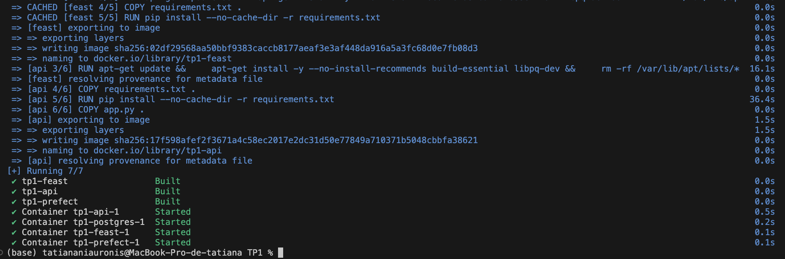

### **Question 1.b**

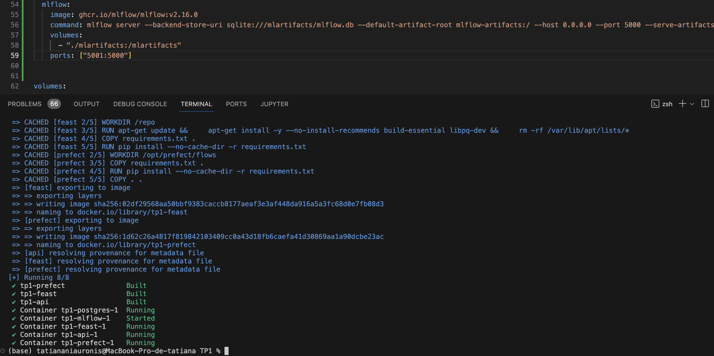

On a exposé le port 5001 de la machine car le port 5000 est déjà occupé par le Control Center d'Apple.

### **Question 1.c**


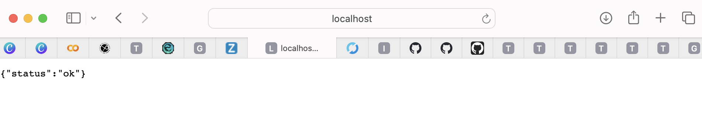

On a bien accès aux interfaces et endpoints.

### **Question 1.d**

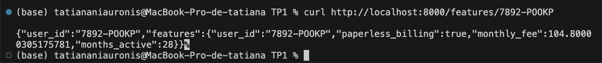

### **Question 1.e**

```bash
docker compose up -d --build
docker compose ps
curl -I http://localhost:5000
curl http://localhost:8000/health
curl http://localhost:8000/features/7892-POOKP

```

Voir les preuves dans les questions correspondantes.

Plusieurs composants tournent simultanément. PostgreSQL stocke les données sources, les snapshots temporels et sert à la fois d’offline et d’online store pour Feast. Feast est utilisé pour gérer et exposer les features de manière cohérente entre l’entraînement et la production. L’API FastAPI permet d’exposer ces features via des endpoints HTTP pour des usages temps réel. MLflow est lancé pour assurer le suivi des expériences, l’enregistrement des modèles et leur promotion future. Enfin, Prefect orchestre les pipelines de données afin de garantir une ingestion et une préparation des données reproductibles.

---

## **Exercice 2 — Créer un script d’entraînement + tracking ML�ow (baseline RandomForest)**

### **Question 2.a**

On utilise pipe et non clf parce que c’est le vrai objet de serving et il contient le preprocessing (OneHotEncoder, passthrough) et le modèle. Si on utilise juste clf, en production on n'aura pas le même encodage des colonnes et donc un predict cassé ou incohérent.

### **Question 2.b**

On a bien ```[OK] Trained baseline RF. rows_after_merge=7043 AUC=0.6233 F1=0.0644 ACC=0.7524 train_time=0.52s (run_id=7656b82f25404001875f3b0ef0194674)```

### **Question 2.c**

La valeur de AS_OF utilisée pour l’entraînement du modèle est 2024-01-31. Le dataset d’entraînement final, obtenu après la jointure entre les features récupérées via Feast et les labels de churn, contient 7043 lignes. 

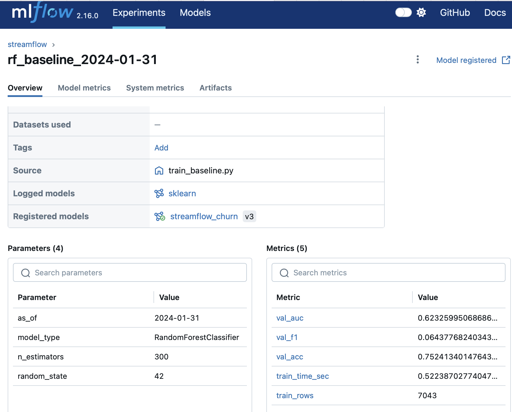

Lors de la phase de préparation des données, une seule colonne catégorielle a été détectée automatiquement, à savoir net_service, tandis que les autres colonnes ont été traitées comme numériques.

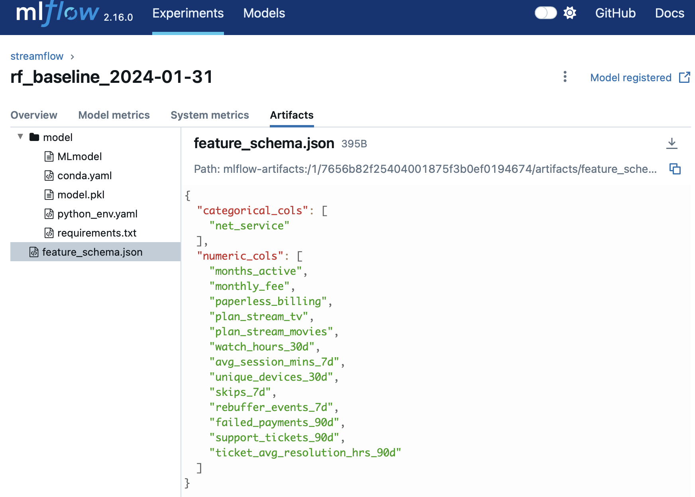


Les métriques calculées sur le jeu de validation montrent une AUC de 0,6233, un F1-score de 0,0644 et une accuracy de 0,7524. Le temps total d’entraînement du modèle RandomForest est d’environ 0,52 seconde. L’ensemble de ces informations (paramètres, métriques, nombre de lignes et schéma des features) est dans MLflow.

### **Question 2.d**

Fixer la valeur de AS_OF est essentiel dans un pipeline MLOps, car cela permet de figer le contexte temporel des données utilisées pour l’entraînement ici au 31 janvier. Les features sont ainsi calculées uniquement à partir des informations disponibles à cette date, ce qui évite toute fuite de données provenant du futur.

De la même manière, fixer le random_state permet de reproduire exactement un entraînement donné, de comparer plusieurs versions de modèles de manière fiable et de faciliter le débogage.

---

## **Exercice 3 — Explorer l’interface ML�ow et promouvoir un modèle**

### **Question 3.a**

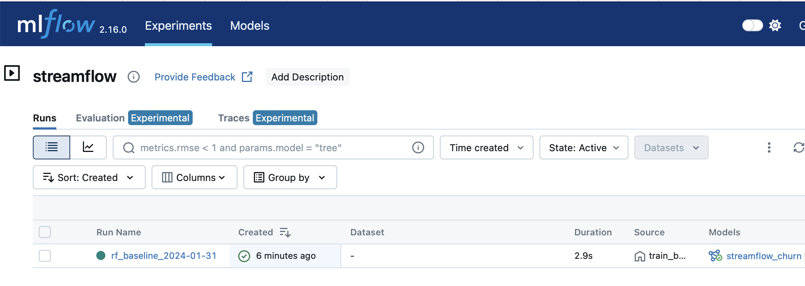

### **Question 3.b**

On a: 

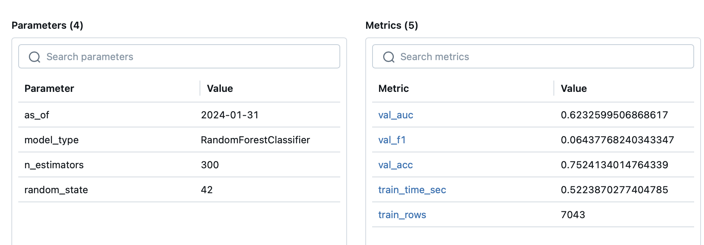

on peut observer l’ensemble des paramètres (AS_OF, random_state, n_estimators, type de modèle), les métriques de validation (AUC, F1, accuracy, temps d’entraînement, nombre de lignes) ainsi que les artefacts, notamment le fichier feature_schema.json décrivant les features utilisées:

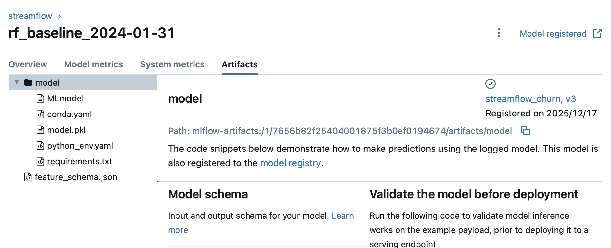

### **Question 3.c**

On a 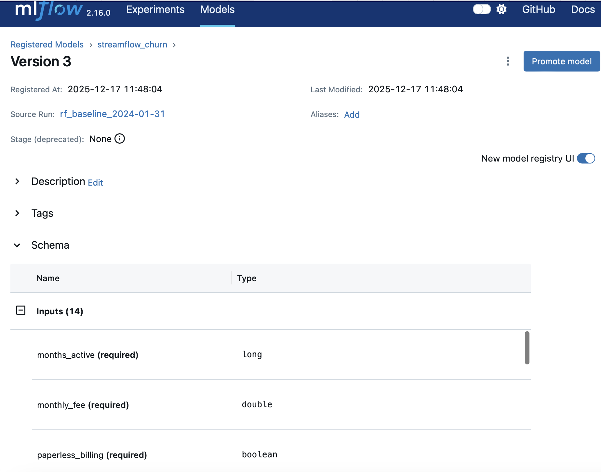

### **Question 3.d**


### **Question 3.e**

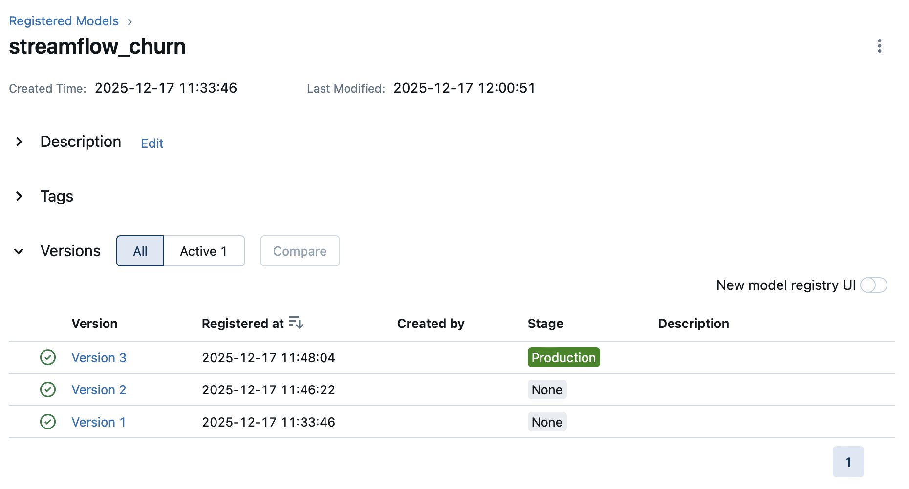
C'est la version 3 qui est en production.

### **Question 3.f**

C'est la version 3 qui est promue (voir captures avant).

### **Question 3.g**

La promotion d’un modèle via des stages (None, Staging, Production) est préférable à un déploiement manuel basé sur des fichiers locaux, car elle apporte un cadre traçable du modèle. Les stages permettent de séparer explicitement les modèles en test de ceux réellement utilisés en production. Cette approche réduit fortement les risques d’erreurs humaines, facilite les rollbacks et garantit que l’API consomme toujours une version validée et identifiée du modèle.

---

## **Exercice 4 — Étendre l’API pour exposer /predict (serving minimal end-to-end)**

### **Question 4.a**

On a bien modifié requiremenrts.txt de l'API.

### **Question 4.b**

On a bien ajouté MLFLOW_TRACKING_URI=http://ml�ow:5000 dans .env

### **Question 4.c**

Nous avons complété le code (voir api/app.py)

### **Question 4.d**

 Avec la commande ```docker compose up -d --build api``` on redemarre bien le service api:

 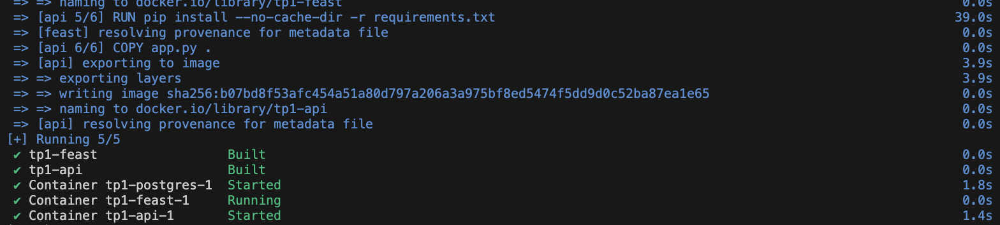

### **Question 4.e/f**

 On atesté POST /predict avec un user_id valide et on a:

 ```(base) tatiananiauronis@MacBook-Pro-de-tatiana TP1 % curl -X POST http://localhost:8000/predict \
  -H "Content-Type: application/json" \
  -d '{"user_id":"7892-POOKP"}'

{"user_id":"7892-POOKP","prediction":0,"features_used":{"months_active":28,"paperless_billing":true,"plan_stream_movies":true,"monthly_fee":104.80000305175781,"plan_stream_tv":true,"net_service":"Fiber optic","skips_7d":4,"avg_session_mins_7d":29.14104461669922,"rebuffer_events_7d":3,"unique_devices_30d":3,"watch_hours_30d":33.258968353271484,"failed_payments_90d":2,"ticket_avg_resolution_hrs_90d":10.800000190734863,"support_tickets_90d":0}}%
```

On peut aussi la faire via Swagger UI:

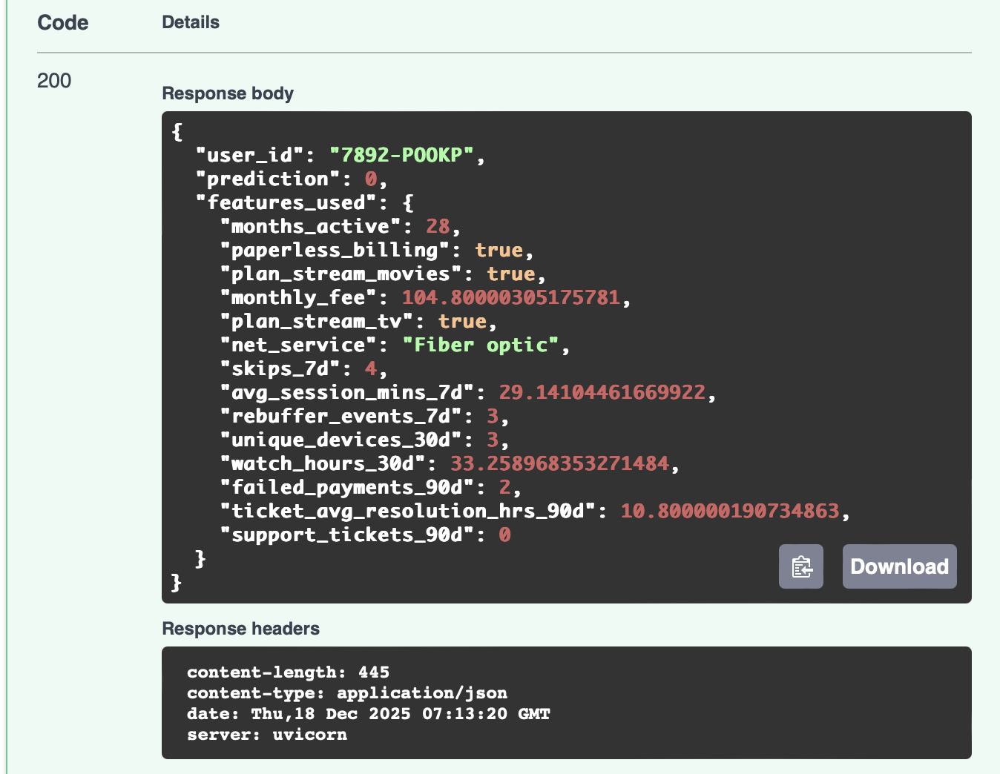


### **Question 4.g**

Pointer l’API vers models:/streamflow_churn/Production garantit qu’elle charge la version officiellement promue du modèle via le Model Registry. On évite ainsi de servir un fichier local .pkl dépendant de la machine, d’un chemin ou d’un conteneur. Le stage Production est une référence stable et on peut mettre à jour le modèle en production en changeant simplement le stage dans MLflow, sans modifier le code de l’API ni redéployer un fichier. Cela améliore la traçabilité, la reproductibilité. Enfin, utiliser un artifact de run fixe (run_id) est moins pratique car cela “fige” l’API sur un run précis.

---

## **Exercice 5 —  Robustesse du serving : cas d’échec réalistes (sans monitoring)**

### **Question 5.a/c**

On conserve:

 ```curl -X POST http://localhost:8000/predict \
  -H "Content-Type: application/json" \
  -d '{"user_id":"7892-POOKP"}'

{"user_id":"7892-POOKP","prediction":0,"features_used":{"months_active":28,"paperless_billing":true,"plan_stream_movies":true,"monthly_fee":104.80000305175781,"plan_stream_tv":true,"net_service":"Fiber optic","skips_7d":4,"avg_session_mins_7d":29.14104461669922,"rebuffer_events_7d":3,"unique_devices_30d":3,"watch_hours_30d":33.258968353271484,"failed_payments_90d":2,"ticket_avg_resolution_hrs_90d":10.800000190734863,"support_tickets_90d":0}}%
```
### **Question 5.b/c**

On obtient :

```
curl -X POST http://localhost:8000/predict \
  -H "Content-Type: application/json" \
  -d '{"user_id":"999999"}'       

{"error":"Missing features for user_id=999999","missing_features":["months_active","paperless_billing","plan_stream_movies","monthly_fee","plan_stream_tv","net_service","skips_7d","avg_session_mins_7d","rebuffer_events_7d","unique_devices_30d","watch_hours_30d","failed_payments_90d","ticket_avg_resolution_hrs_90d","support_tickets_90d"]}% 
```

Ici, l’API ne renvoie que des valeurs manquantes parce que Feast ne trouve pas de valeurs dans l’online store pour user_id=999999. Les features récupérées sont donc manquantes: "Missing features for user_id=999999".

### **Question 5.c**

En production, beaucoup d’échecs viennent des features plutôt que du modèle. Par exemple, on peut avoir l’entité absente : si le user_id demandé n’existe pas dans l’online store (nouvel utilisateur, faute de frappe), Feast renvoie des valeurs manquantes et l’API ne doit pas prédire. On peut aussi avoir un online store incomplet ou obsolète : si la matérialisation n’a pas été lancée, a échoué ou n’est pas à jour, certaines features deviennent manquantes même pour un utilisateur réel. 

Le check missing_features permet de détecter ça immédiatement côté API (avant d’appeler le modèle) ce qui évite des prédictions incohérentes et rend le diagnostic plus rapide (problème de données/materialisation et non du modèle).

---

## **Exercice 6 —  Réfexion de synthèse (ingénierie MLOps)**

### **Question 6.a**

MLflow garantit la traçabilité complète des entraînements en enregistrant pour chaque run les paramètres (AS_OF), les métriques (AUC, F1, accuracy), les artefacts (modèle, schéma des features, environnement). Cela permet de comprendre précisément comment un modèle a été entraîné, sur quelles données et avec quelles hypothèses.
De plus, MLflow garantit l’identification du modèle servi grâce au Model Registry : l’API charge une version précise (chez nous version 3) d’un modèle enregistré, associée à un stage (chez nous Production), ce qui assure que le modèle utilisé est connu et traçable.

### **Question 6.b**

Le stage Production indique quel modèle doit être chargé automatiquement par l’API au démarrage via l’URI models:/streamflow_churn/Production. L’API ne dépend donc ni d’un numéro de version ni d’un chemin local : elle charge toujours le modèle.
Cela permet de changer de modèle sans modifier ni redéployer le code de l’API avec une autre version dans le registry. À l’inverse, cela empêche les déploiements implicites ou non contrôlés car une seule version est autorisée en Production à tel instant.

### **Question 6.c**

Même avec MLflow, la reproductibilité peut encore casser à plusieurs endroits :

- Les données : si les tables sources changent (corrections, suppressions, ajouts), le dataset reconstruit pour un même AS_OF peut différer. Le conteneur Postgres permet de versionner et reproduire le résultat d'une étape passée.

- Le code : une modification du script d’entraînement ou du preprocessing, sans versionnement casse le fait qu'on puisse comparer. Mais grace à Github nous avons les tags qui nous permettent de retrouver toutes les étapes et versions du code.

- L’environnement : une dépendance Python ou système différente (versions) peut modifier le comportement du modèle. Mais ici, on a des versions fixées pour nos librairies et l'envrionnement dans le .env.


