# **rapport_tp5.md — TP5 Monitoring et observabilité**
NIAURONIS Tatiana – FIPA 3A  
CSC8613 – TP5

---

## **Exercice 1 — Démarrer la stack pour l'observabilité**

### **Question 1.a**

On a mis à jour le docker-compose.yml comme demandé.

### **Question 1.b**

On a bien rajouté le service prometheus.

### **Question 1.c**

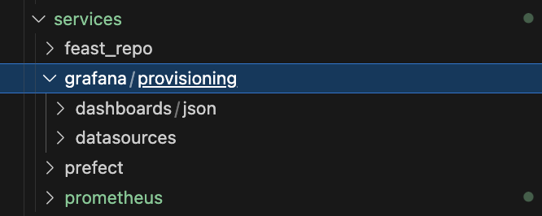

### **Question 1.e**

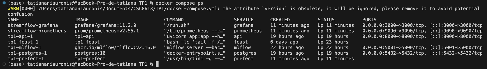

D’après docker compose ps, les conteneurs sont :

- streamflow-prometheus : service Prometheus (monitoring),

- streamflow-grafana : service Grafana (visualisation),

- tp1-api-1 : API FastAPI de prédiction,

- tp1-postgres-1 : base de données PostgreSQL,

- tp1-feast-1 : Feature Store Feast,

- tp1-mlflow-1 : MLflow (tracking + registry),

- tp1-prefect-1 : orchestration des jobs.

Prometheus s’exécute dans un conteneur Docker et localhost désigne alors le conteneur Prometheus lui-même, et non la machine hôte. Il utilise donc api:8000, qui correspond au nom du service Docker résolu via le réseau interne Docker, pour joindre correctement l’API FastAPI.

### **Question 1.f**

On a :

```
(base) tatiananiauronis@MacBook-Pro-de-tatiana TP1 % docker compose up -d
WARN[0000] /Users/tatiananiauronis/Documents/CSC8613/TP1/docker-compose.yml: the attribute `version` is obsolete, it will be ignored, please remove it to avoid potential confusion 
[+] Running 17/24
 ⠼ prometheus [⣿⣿⣷⣿⣿⣿⣿⣿⣿⣿⣿⣿] 102.8MB / 108.5MB Pulling                                                                                              10.4s[+] Running 17/24
 ⠴ prometheus [⣿⣿⣷⣿⣿⣿⣿⣿⣿⣿⣿⣿] 103.3MB / 108.5MB Pulling                                                                                             10.5s[+] Running 17/24
 ⠦ prometheus [⣿⣿⣷⣿⣿⣿⣿⣿⣿⣿⣿⣿] 103.3MB / 108.5MB Pulling                                                                                             10.6s[+] Running 17/24
 ⠏ prometheus [⣿⣿⣷⣿⣿⣿⣿⣿⣿⣿⣿⣿] 105.5MB / 108.5MB Pulling                                                                  [+] Running 17/24         13.9s 
 ⠋ prometheus [⣿⣿⣷⣿⣿⣿⣿⣿⣿⣿⣿⣿] 105.5MB / 108.5MB Pulling                                                                  [+] Runni[+] Running 24/2414.0s 
 ✔ prometheus Pulled                                                                                                       20.3s 
 ✔ grafana Pulled                                                                                                          47.2s 
[+] Running 8/8
 ✔ Volume tp1_grafana-data          Created                                                                                 0.0s 
 ✔ Container tp1-mlflow-1           Running                                                                                 0.0s 
 ✔ Container tp1-postgres-1         Running                                                                                 0.0s 
 ✔ Container tp1-feast-1            Running                                                                                 0.0s 
 ✔ Container tp1-api-1              Running                                                                                 0.0s 
 ✔ Container tp1-prefect-1          Started                                                                                 1.1s 
 ✔ Container streamflow-prometheus  Started                                                                                 1.1s 
 ✔ Container streamflow-grafana     Started                                                                                 1.0s 
(base) tatiananiauronis@MacBook-Pro-de-tatiana TP1 % docker compose ps
WARN[0000] /Users/tatiananiauronis/Documents/CSC8613/TP1/docker-compose.yml: the attribute `version` is obsolete, it will be ignored, please remove it to avoid potential confusion 
NAME                    IMAGE                           COMMAND                  SERVICE      CREATED          STATUS          PORTS
streamflow-grafana      grafana/grafana:11.2.0          "/run.sh"                grafana      52 seconds ago   Up 50 seconds   0.0.0.0:3000->3000/tcp, [::]:3000->3000/tcp
streamflow-prometheus   prom/prometheus:v2.55.1         "/bin/prometheus --c…"   prometheus   52 seconds ago   Up 50 seconds   0.0.0.0:9090->9090/tcp, [::]:9090->9090/tcp
tp1-api-1               tp1-api                         "uvicorn app:app --h…"   api          19 hours ago     Up 19 hours     0.0.0.0:8000->8000/tcp, [::]:8000->8000/tcp
tp1-feast-1             tp1-feast                       "bash -lc 'tail -f /…"   feast        6 days ago       Up 22 hours     
tp1-mlflow-1            ghcr.io/mlflow/mlflow:v2.16.0   "mlflow server --bac…"   mlflow       22 hours ago     Up 22 hours     0.0.0.0:5001->5000/tcp, [::]:5001->5000/tcp
tp1-postgres-1          postgres:16                     "docker-entrypoint.s…"   postgres     19 hours ago     Up 19 hours     0.0.0.0:5432->5432/tcp, [::]:5432->5432/tcp
tp1-prefect-1           tp1-prefect                     "/usr/bin/tini -g --…"   prefect      52 seconds ago   Up 50 seconds   
(base) tatiananiauronis@MacBook-Pro-de-tatiana TP1 % 
```

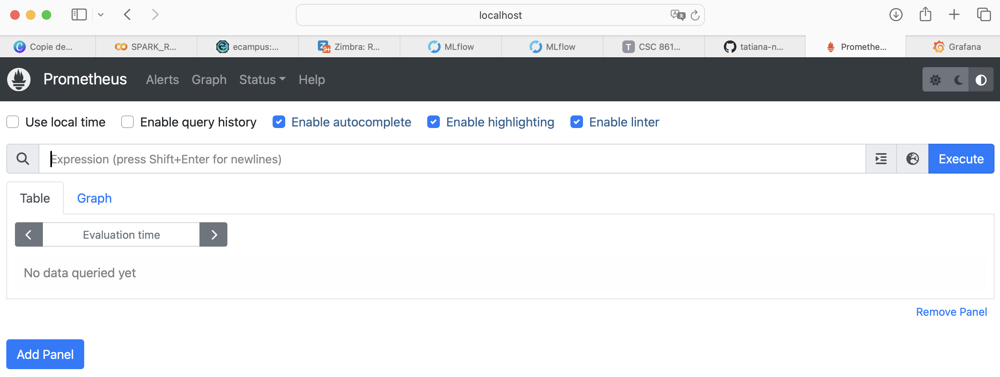

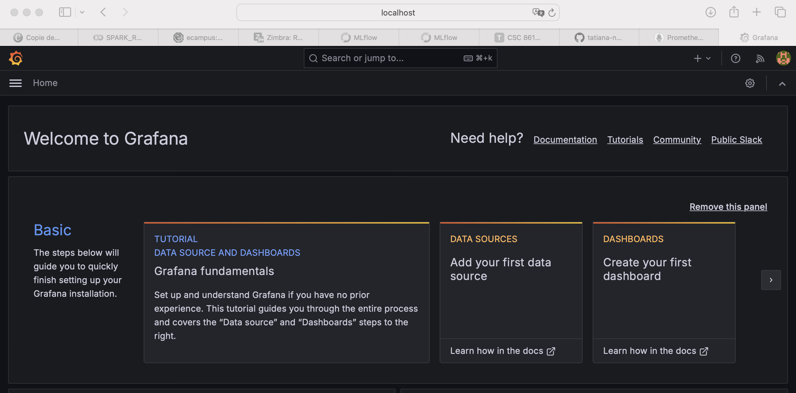

---

## **Exercice 2 — Instrumentation de FastAPI avec de métriques Prometheus**

### **Question 2.a**

On a bien modifié app.py.

### **Question 2.b/c**

On a :

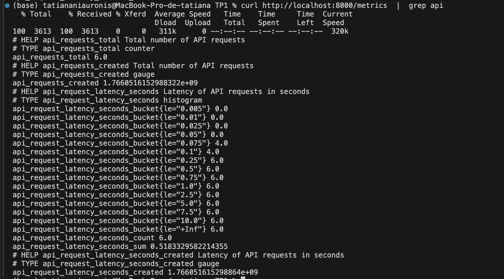

Une moyenne de latence peut masquer des requêtes très lentes si par exemple la majorité des requêtes sont rapides mais une infime partie sont très lentes car la moyenne reste bonne alors que l’expérience utilisateur se dégrade. Un histogramme enregistre une distribution via des buckets, ce qui permet d’estimer des percentiles (p95/p99).

---

## **Exercice 3 — Exploration de Prometheus (Targets, Scrapes, PromQL)**

### **Question 3.a**

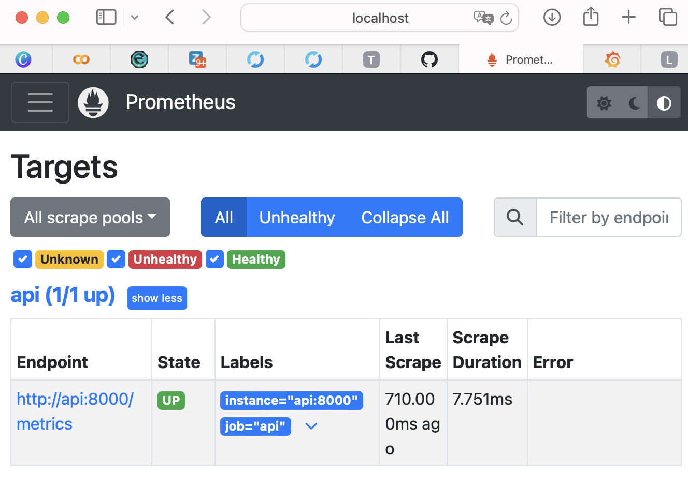

L'état est bien up.

### **Question 3.b**

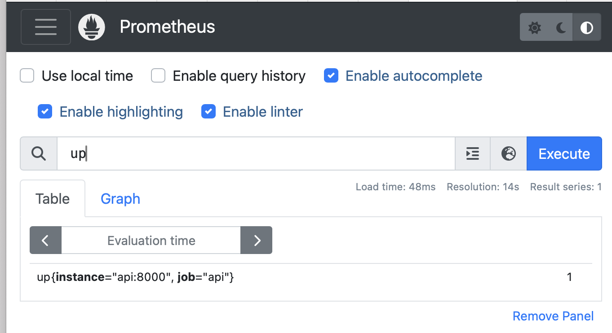

La valeur 1 indique que Prometheus arrive bien à scrapper l’API. La target est donc UP, ce qui confirme que l’endpoint /metrics est accessible et fonctionnel.

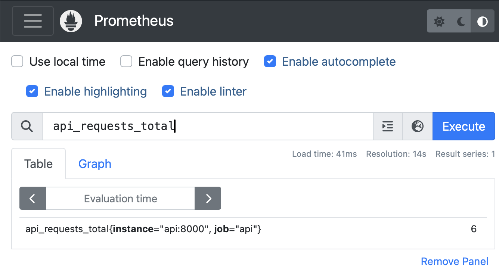

Cette métrique correspond au nombre total de requêtes reçues par l’API depuis son démarrage. La valeur augmente à chaque appel de l’endpoint /predict comme ce que nous avons vu au dessus.

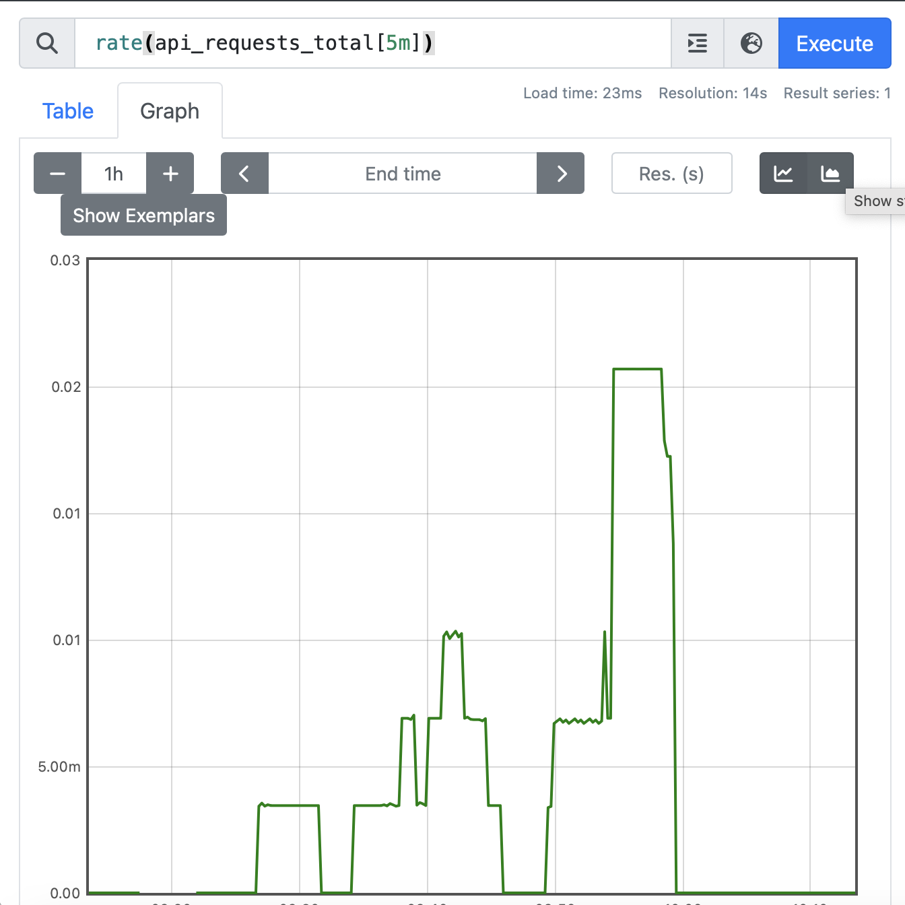

Cette requête mesure le taux moyen de requêtes par seconde sur les 5 dernières minutes. La valeur est 0 car les requêtes ont été envoyées ponctuellement et non de manière continue et il y'a plus de 5 minutes.

### **Question 3.c**

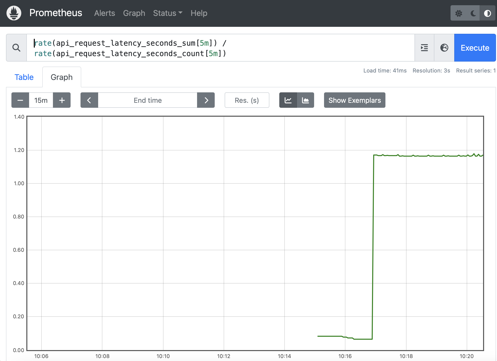

Cette courbe représente la latence moyenne des requêtes de l’API sur une fenêtre glissante. On observe une augmentation nette de la valeur lorsque des requêtes /predict sont générées.

### **Question 3.d**

Voir les images au dessus.

---

## **Exercice 4 — Setup de Grafana Setup et création d'un dashboard minimal**

### **Question 4.a**

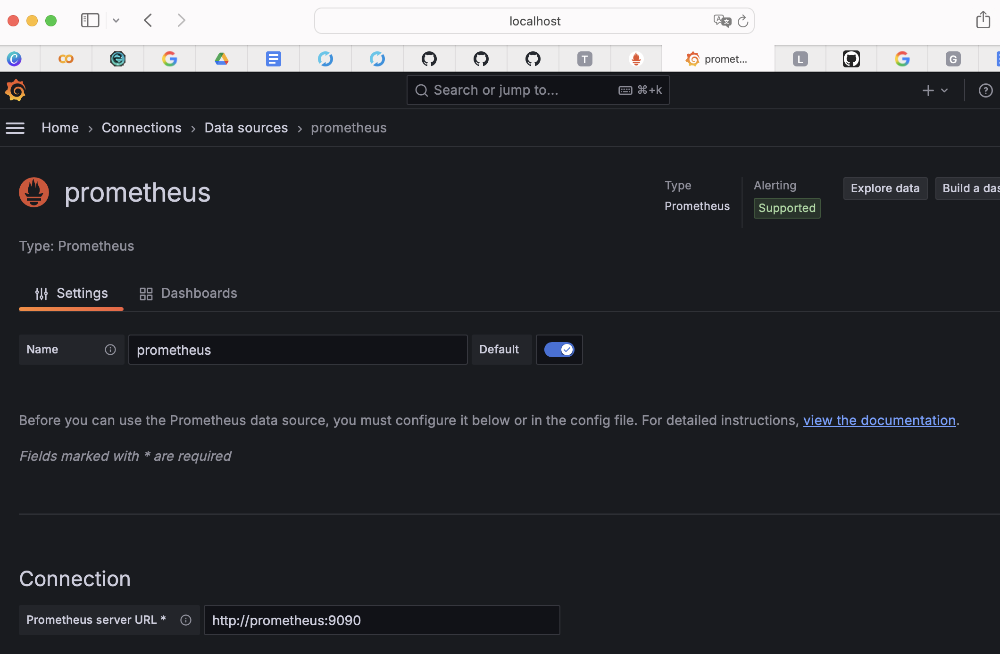

### **Question 4.b/c/d/e**

On a :

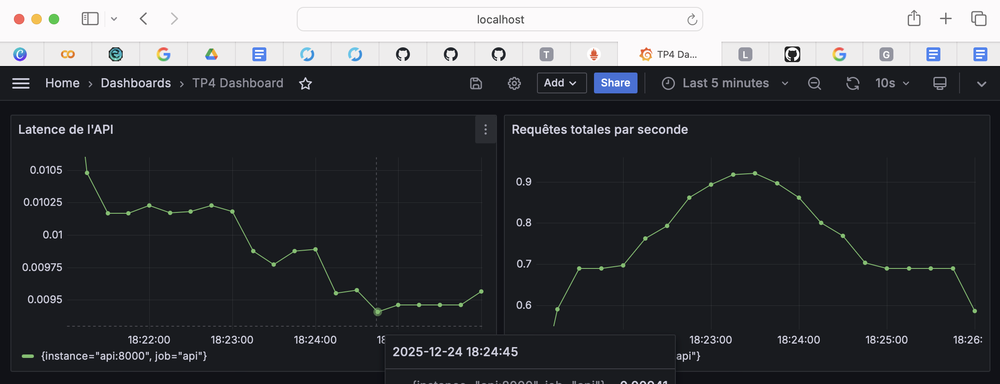

Ici, on observe bien les variations dans la latence de l'API et sur la courbes des requêtes. J'ai envoyé les requêtes de façon desordonnée à la main.

Par exemple, l’éditeur de requête d’un panel ressemble à:

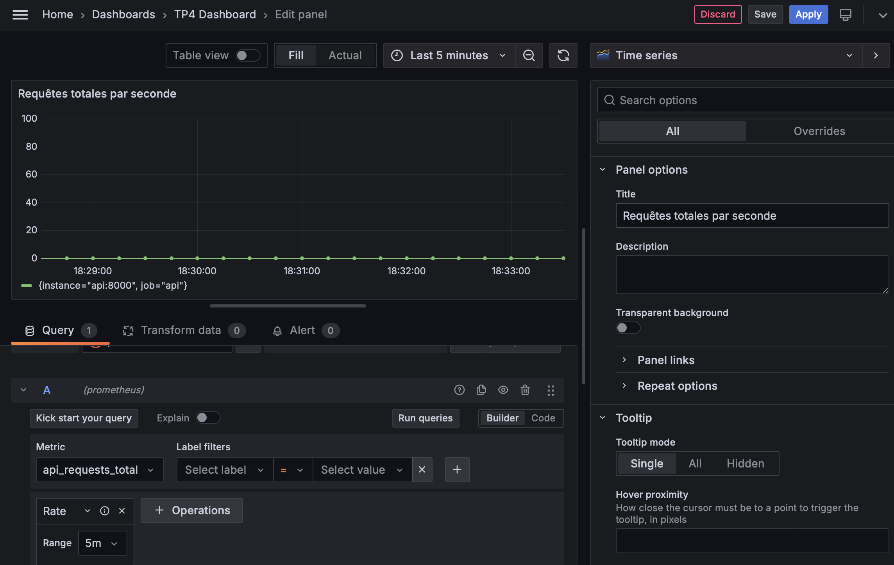

Les métriques exposées via Prometheus et visualisées dans Grafana permettent de détecter efficacement la charge de l’API (nombre de requêtes par seconde) ainsi que son comportement en termes de latence et de stabilité. On peut y voir les pics de trafic et ainsi mettre des alertes au dela d'un certain seuil pour être sur que le client qui effectue la requête est bien servi. En revanche, ces métriques ne donnent aucune information sur la qualité du modèle de machine learning lui-même : elles ne permettent pas de savoir si les prédictions sont correctes, si le modèle dérive... On n'a pas les métriques comme F1 AUC et Accuracy sur MLFlow.

---

## **Exercice 5 — Drift Detection with Evidently (Month_000 vs Month_001)**

### **Question 5.a**

Voir le code.

### **Question 5.b**

On a bien les rapports qui sont crées. 


La ligne finale contient bien:

```
17:56:41.261 | INFO    | Task run 'decide_action-e07' - Finished in state Completed()
[Evidently] report_html=/reports/evidently/drift_2024-01-31_vs_2024-02-29.html report_json=/reports/evidently/drift_2024-01-31_vs_2024-02-29.json drift_share=0.06 -> NO_ACTION drift_share=0.06 < 0.30 (target_drift=0.0)
```

Ainsi, on a :

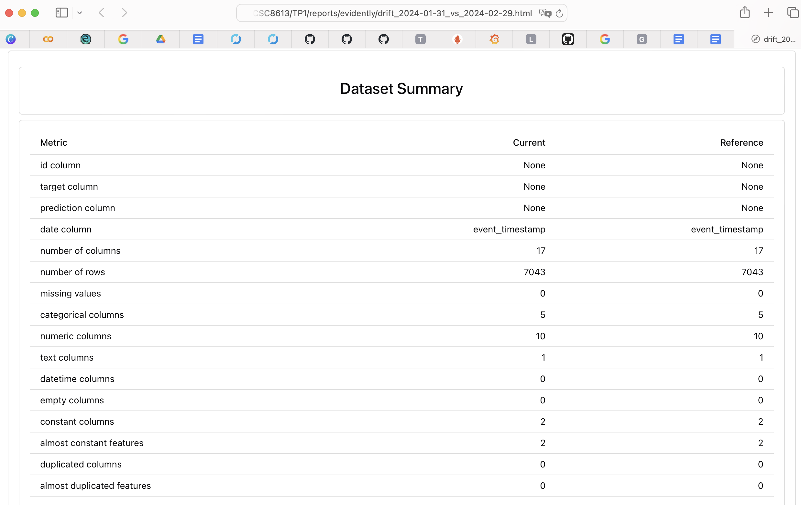

On voit bien qu'on a le même nombre de lignes.

### **Question 5.c**

La décision finale est:

```
17:56:41.261 | INFO    | Task run 'decide_action-e07' - Finished in state Completed()
[Evidently] report_html=/reports/evidently/drift_2024-01-31_vs_2024-02-29.html report_json=/reports/evidently/drift_2024-01-31_vs_2024-02-29.json drift_share=0.06 -> NO_ACTION drift_share=0.06 < 0.30 (target_drift=0.0)
```
Le covariate drift correspond à un changement dans la distribution des variables d’entrée du modèle et le target drift correspond à un changement dans la distribution de la variable cible (churn_label).

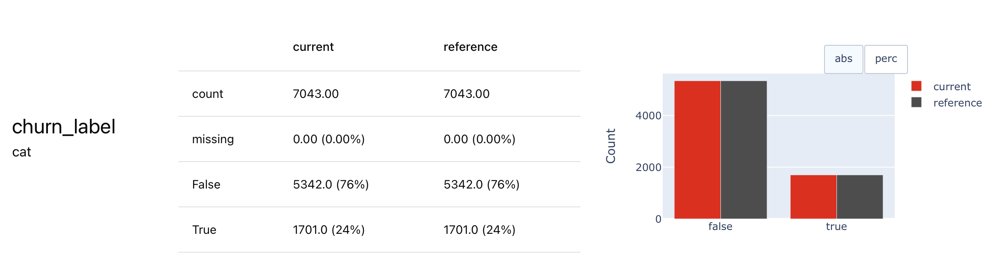


