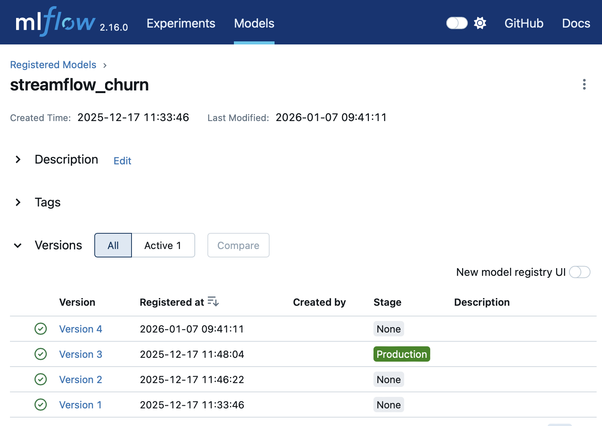
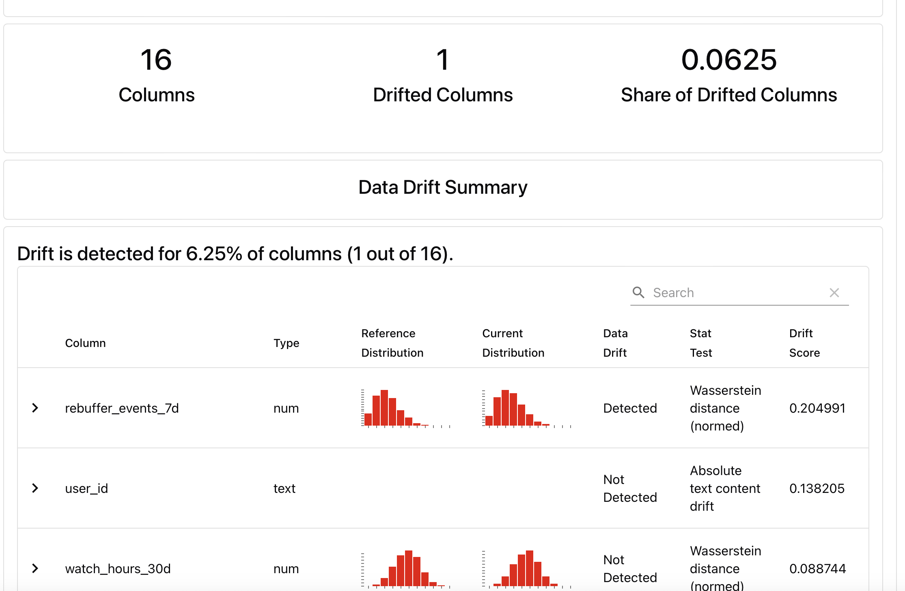
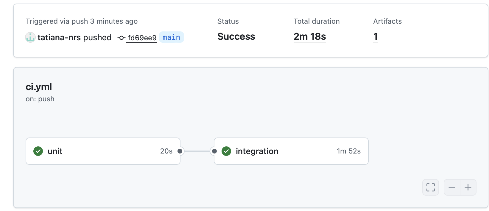

# **rapport_tp6.md — TP6 CI/CD pour systèmes ML + réentraînement automatisé + promotion MLflow**
NIAURONIS Tatiana – FIPA 3A  
CSC8613 – TP6

---

## **Exercice 1 — Mise en place du rapport et vérifications de départ**

### **Question 1.d**

Tous les services sont bien up :

```
(base) tatiananiauronis@MBP-de-tatiana TP1 % docker compose up -d 
[+] Running 7/7
 ✔ Container tp1-mlflow-1           Running                                        0.0s 
 ✔ Container tp1-postgres-1         Running                                        0.0s 
 ✔ Container tp1-feast-1            Running                                        0.0s 
 ✔ Container tp1-prefect-1          Running                                        0.0s 
 ✔ Container tp1-api-1              Running                                        0.0s 
 ✔ Container streamflow-prometheus  Running                                        0.0s 
 ✔ Container streamflow-grafana     Running                                        0.0s 
```

```
(base) tatiananiauronis@MBP-de-tatiana TP1 % docker compose ps
NAME                    IMAGE                           COMMAND                  SERVICE      CREATED       STATUS          PORTS
streamflow-grafana      grafana/grafana:11.2.0          "/run.sh"                grafana      2 weeks ago   Up 10 minutes   0.0.0.0:3000->3000/tcp, [::]:3000->3000/tcp
streamflow-prometheus   prom/prometheus:v2.55.1         "/bin/prometheus --c…"   prometheus   2 weeks ago   Up 10 minutes   0.0.0.0:9090->9090/tcp, [::]:9090->9090/tcp
tp1-api-1               tp1-api                         "uvicorn app:app --h…"   api          2 weeks ago   Up 10 minutes   0.0.0.0:8000->8000/tcp, [::]:8000->8000/tcp
tp1-feast-1             tp1-feast                       "bash -lc 'tail -f /…"   feast        3 weeks ago   Up 10 minutes   
tp1-mlflow-1            ghcr.io/mlflow/mlflow:v2.16.0   "mlflow server --bac…"   mlflow       2 weeks ago   Up 10 minutes   0.0.0.0:5001->5000/tcp, [::]:5001->5000/tcp
tp1-postgres-1          postgres:16                     "docker-entrypoint.s…"   postgres     2 weeks ago   Up 10 minutes   0.0.0.0:5432->5432/tcp, [::]:5432->5432/tcp
tp1-prefect-1           tp1-prefect                     "/usr/bin/tini -g --…"   prefect      2 weeks ago   Up 10 minutes 
```

C'est la version 3 qui est en production:


---

## **Exercice 2 — Ajouter une logique de décision testable (unit test)**

### **Question 2.d**

On a bien un succès pour la commande:

```
(base) tatiananiauronis@MBP-de-tatiana TP1 % pytest -q
..                                                                               [100%]
2 passed in 0.02s
```

On extrait une fonction pure pour pouvoir la tester rapidement et de façon déterministe, sans infrastructure ni effets de bord.

---

## **Exercice 3 — Créer le flow Prefect train_and_compare_flow (train → eval → compare → promote)**

### **Question 3.d**

Les logs du flow regroupent:

```
08:41:13.294 | INFO    | Task run 'evaluate_production-2f7' - Finished in state Completed()
[COMPARE] candidate_auc=0.6499 vs prod_auc=0.9391 (delta=0.0100)
[DECISION] skipped
08:41:13.339 | INFO    | Task run 'compare_and_promote-243' - Finished in state Completed()
[SUMMARY] as_of=2024-02-29 cand_v=4 cand_auc=0.6499 prod_v=3 prod_auc=0.9391 -> skipped
08:41:13.370 | INFO    | Flow run 'rare-boobook' - Finished in state Completed()
```

Dans MLFlow, on a bien une nouvelle version 4 mais la version 3 reste en Production car l'auc est de 0.6499 ce qui est inférieur à 0.9391+ delta:



Ici, on utilise un delta pour éviter de promouvoir un modèle pour une amélioration trop faible et trop proche de l'auc actuelle, on veut un gain significatif sur l'auc.

---

## **Exercice 4 — Connecter drift → retraining automatique (monitor_flow.py)**

### **Question 4.c**

Le drift s'est déclenché comme on peut le voir ici d'après les logs:

```
09:03:52.823 | INFO    | Task run 'decide_action-130' - Finished in state Completed()
[Evidently] report_html=/reports/evidently/drift_2024-01-31_vs_2024-02-29.html report_json=/reports/evidently/drift_2024-01-31_vs_2024-02-29.json drift_share=0.06 -> RETRAINING_TRIGGERED drift_share=0.06 >= 0.02 -> skipped
```
Un drift est détecté sur 6.25 % des features, principalement sur la variable rebuffer_events_7d comme on peut le voir ici :



---

## **Exercice 5 — Redémarrage API pour charger le nouveau modèle Production + test /predict**

### **Question 5.a**

On a redémarré le service API (même si on n'a pas ):

```
(base) tatiananiauronis@MBP-de-tatiana TP1 % docker compose restart api 
[+] Restarting 1/1
 ✔ Container tp1-api-1  Started 
```

```
 api-1  | INFO:     Uvicorn running on http://0.0.0.0:8000 (Press CTRL+C to quit)
api-1  | INFO:     172.19.0.7:44996 - "GET /metrics HTTP/1.1" 200 OK
```

### **Question 5.c**

```
(base) tatiananiauronis@MBP-de-tatiana TP1 % curl -s -X POST "http://localhost:8000/predict" \
  -H "Content-Type: application/json" \
  -d '{"user_id":"7892-POOKP"}'  
{"user_id":"7892-POOKP","prediction":0,"features_used":{"plan_stream_movies":true,"monthly_fee":104.80000305175781,"plan_stream_tv":true,"net_service":"Fiber optic","months_active":28,"paperless_billing":true,"watch_hours_30d":33.258968353271484,"skips_7d":4,"unique_devices_30d":3,"rebuffer_events_7d":3,"avg_session_mins_7d":29.14104461669922,"failed_payments_90d":2,"ticket_avg_resolution_hrs_90d":10.800000190734863,"support_tickets_90d":0}}%
```

L'API doit être redémarrée pour recharger la nouvelle version du modèle et sinon l'API utiliserait l'ancienne version en mémoire. Mais ici, on a gardé l'ancien modèle car il est meilleur pour l'auc.

---

## **Exercice 6 — CI GitHub Actions (smoke + unit) avec Docker Compose**

### **Question 6.b**

Les deux jobs sont bien passés:



### **Question 6.c**

Le run est bien passé:


On démarre Docker Compose dans la CI pour exécuter un test rapide d’intégration multi-services (Postgres + Feast + MLflow + API) et valider que l’API démarre correctement de manière indépendante à notre ordinateur. 

---

## **Exercice 7 — Synthèse finale : boucle complète drift → retrain → promotion → serving**

### **Question 7.a - Synthèse**

Ce TP met en œuvre une boucle MLOps.

Le drift est mesuré à l’aide d’Evidently en comparant deux périodes (month_000 vs month_001). On utilise drift_share qui correspond à la proportion de features dont la distribution a changé comme on l'a vu précédemment. Un seuil de 0.02 est utilisé pour déclencher le réentraînement dans ce TP. Ce seuil est volontairement bas pour montrer ici comment ça fonctionne mais en pratique il serait plus élevé afin d’éviter des réentraînements trop fréquents et coûteux.

Lorsque le seuil est dépassé, le flow Prefect appelle automatiquement train_and_compare_flow qui entraîne un modèle candidat sur les même données, l’évalue sur un jeu de validation et compare sa performance (val_auc) au modèle actuellement en Production. Le modèle candidat est promu uniquement si son val_auc dépasse celui du modèle Production d’au moins un delta. Le delta garantit que seules des améliorations significatives sont déployées.

Une fois promu dans le MLflow Model Registry, le nouveau modèle est chargé en production après redémarrage de l’API.

Prefect orchestre la logique MLOps avec le monitoring de drift, le déclenchement du réentraînement, la partie entraînement, évaluation, comparaison et la promotion du modèle dans MLflow.

GitHub Actions assure la qualité du code via la CI à savoir les tests d'intégrations multi-services via Docker Compose.


### **Question 7.b - Limites/améliorations**

La CI ne doit pas entraîner le modèle complet car l’entraînement est coûteux, lent alors qu'elle doit rester rapide et vérifier l'intégration minimale.

Des tests supplémentaires pourraient être ajoutés comme des tests de schéma des données ou encore des tests pour la création des features.

En vrai une approbation humaine est souvent nécessaire avant promotion pour avoir une validation métier car la seule métrique val_auc ne suffit pas pour déployer un modèle. En effet, il faut auditer les modèles.


